System zarządzania ruchem międzygwiezdnym

Projekt PRI+MAS

Dziedzina problemowa
====================

System wspomaga zarządzanie ruchem jednostek w przestrzeni kosmicznej z użyciem sieci bram hiperprzestrzennych. Udostępnia on także dane o systemach gwiezdnych, stacjach kosmicznych i planetach.

Cel
===

Ujednolicenie i zgromadzenie danych o ruchu w galaktyce, uproszczenie systemu opłat, wspomaganie ustalania przyczyn zdarzeń w ruchu. Rozwiązanie ma zapewnić niezawodną i scentralizowaną kontrolę nad siecią bram i kanałów

Zakres odpowiedzialności systemu
================================

System wspomaga pobór opłat podczas podróży z użyciem bram. Dodatkowo udostępnia podróżnym informacje na temat punktów użyteczności publicznej takich jak stacje serwisowe, restauracje, posterunki straży gwiezdnej oraz o warunkach panujących w danym systemie. Wszystkie akcje są zapisywane w systemie do ew. późniejszej analizy.

Użytkownicy systemu
===================

1.  Operatorzy urządzeń komunikacyjnych na jednostkach kosmicznych

2.  Pracownicy bram międzygwiezdnych.

3.  Pracownicy centrali sieci tuneli i bram.

Wymagania użytkownika
=====================

1.  System gwiezdny składa się z gwiazdy (zespoły gwiazd traktujemy jako jedną), co najmniej jednej planety oraz pasów asteroid na swoich orbitach. Przy planetach mogą znajdować się punkty użyteczności publicznej (PUP). W systemie gwiezdnym znajdują się bramy do innych systemów.

2.  Dla każdej gwiazdy pamiętany jest strumień i rodzaj promieniowania.

3.  Dla planet ma być znany przybliżony skład atmosfery (w formie listy substancji), ich warunki atmosferyczne, średnią odległość od gwiazdy, czas okrążenia gwiazdy oraz przesunięcie fazy obrotu. Pozycja w danym momencie wyliczana jest na podstawie tych danych.

4.  Pasy asteroid mają zdefiniowany obszar w formie promienia wewnętrznego i szerokości. Na tym obszarze nie mogą występować żadne budowle.

5.  PUP może znajdować się na planecie, jej księżycu lub na własnej orbicie dookoła planety. Dla punktów na orbicie obliczany jest poziom promieniowania na podstawie odległości od gwiazdy i jej parametrów. PUP nie może się znajdować w polu promieniowania przekraczającego 1000 jednostek (w związku z pracami nad ustawą w tej kwestii, wartość ta może ulec zmianie).

6.  PUP dzielą się między innymi na punkty umożliwiające odpoczynek (punkty odpoczynku) oraz punkty serwisowe. Punkty odpoczynku mają znaną minimalną opłatę za pobyt przez jedną dobę ziemską oraz ocenę (wyliczaną na podstawie opinii podróżnych poza systemem). Punkty serwisowe mają zdefiniowaną listę typów jednostek, które mogą serwisować.

7.  Jednostki posiadają swój typ, masę i przeznaczenie. Dodatkowo każda musi mieć zdefiniowanego właściciela oraz kapitana. Na czas przelotu mają być znane lista załogi oraz opis ładunku.

8.  Bramy gwiezdne mają pamiętaną pozycję w układzie (odległość od gwiazdy oraz kąt) oraz system gwiezdny do którego prowadzą. Każda brama może przenosić jednostki do określonej masy. Pamiętana jest także opłata za jednostkę masy, która pozwala na wyliczenie ceny przelotu. W związku z dużym poborem mocy z jednocześnie długim czasem otwierania przejścia, bramy są otwierane na żądanie.

9.  Żądanie otwarcia ma zapamiętany czas planowanego przelotu oraz listę jednostek. Cena przelotu jest obliczana dla każdego żądania. Jeżeli podczas jednego otwarcia przez bramę jest planowany przelot więcej niż 25 jednostek, udzielany jest rabat. Żądanie zostaje przyjęte przez system (status „przyjęte”), następnie musi zostać zaakceptowane (status „zaakceptowane”) lub odrzucone (status „odrzucone”) przez obsługę. Po zaakceptowaniu na czas otwarcia bramy żądanie przyjmuje status „oczekujące”, a następnie „gotowe”. Po wykonaniu przelotu status zmieniany jest na „zakończone”.

10. Jeżeli w czasie podróży zdarzył się wypadek, system zapisuje to jako zdarzenie. Zdarzenie musi zawierać informację o podróży (jako odnośnik do żądania otwarcia bramy) oraz opis zdarzenia. Określany jest typ zdarzenia jako jeden z następujących: „awaria jednostki”, „kolizja”, „nielegalne użycie bramy”, „atak piracki”, „uraz lub choroba załogi”, „awaria bramy”, „przemyt”, „inny”.

11. System wspomaga następujące funkcjonalności:

    1.  Zaplanowanie trasy z użyciem bram. Powinna zostać uwzględniona masa największej jednostki.

    2.  Złożenie żądania użycia łańcucha bram (także jednej bramy).

    3.  Znalezienie PUP w pobliżu trasy.

    4.  Stworzenie raportu zysków z bram.

    5.  Wypisanie najczęściej używanych bram w danym roku ziemskim.

12. System pracuje na serwerze znajdującym się w centrali sieci. Komunikuje się z komputerami bram bezprzewodowo za pośrednictwem wąskich tuneli hiperprzestrzennych. Dalej komputery te prowadzą komunikację radiową z jednostkami (wykorzystywane jest połączenie z urządzeniami komunikacyjnymi wymaganymi przez ustawy).

Wymagania funkcjonalne
======================

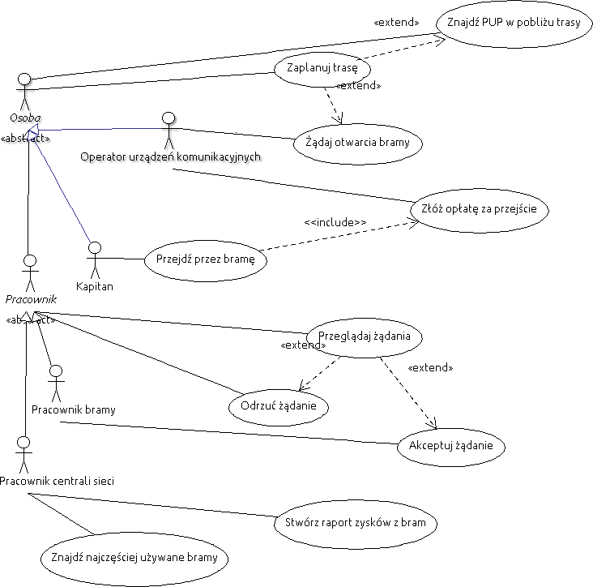

Rysunek 1 Uproszczony diagram przypadków użycia

Opis struktury systemu
======================

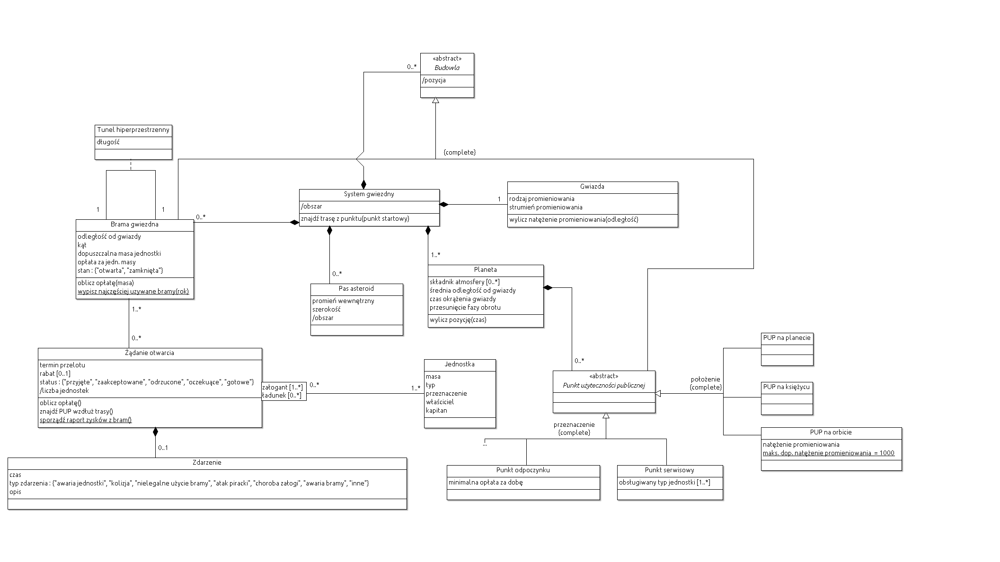

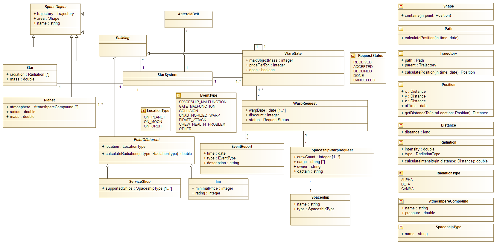

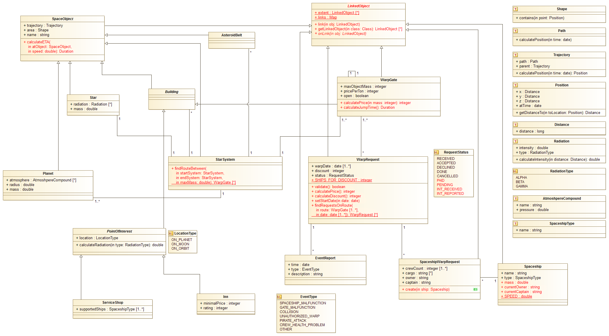

Przypadek użycia „Żądaj otwarcia bramy”
=======================================

Rysunek 5 Diagram przypadku użycia "Żądaj otwarcia bramy"

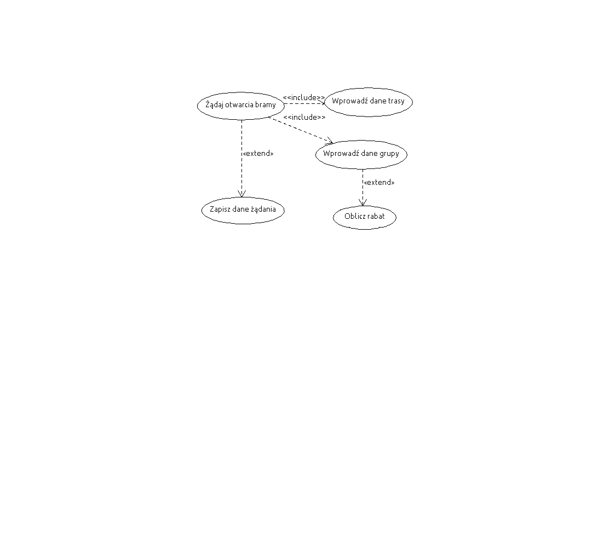

| Nazwa przypadku użycia         | Żądaj otwarcia bramy                                                                                                                                                                                                                                |
|--------------------------------|-----------------------------------------------------------------------------------------------------------------------------------------------------------------------------------------------------------------------------------------------------|
| Aktorzy                        | Operator urządzeń komunikacyjnych                                                                                                                                                                                                                   |
| Opis                           | Zgłoszenie chęci przemieszczenia się pomiędzy odległymi systemami gwiezdnymi przy użyciu łańcucha bram międzygwiezdnych.                                                                                                                            |
| Warunek początkowy             | 1.  Żądane jednostki istnieją w systemie.                                                                                                                                                                                                           
                                                                                                                                                                                                                                                                                       
                                  2.  W systemie istnieją co najmniej 2 systemy z bramami tworzącymi wspólny tunel.                                                                                                                                                                    |
| Warunek końcowy                | 1.  Przypadek może być przerwany w dowolnym momencie przez operatora.                                                                                                                                                                               
                                                                                                                                                                                                                                                                                       
                                  2.  W systemie zostało zapisane żądanie otwarcia bramy lub przejście przez sieć nie jest możliwe (w przypadku podanych jednostek).                                                                                                                   |
| Główny przepływ zdarzeń        | 1.  System pyta operatora o początek i cel podróży. Operator podaje dane.                                                                                                                                                                           
                                                                                                                                                                                                                                                                                       
                                  2.  System pyta o jednostki, towary oraz załogę. Operator podaje dane.                                                                                                                                                                               
                                                                                                                                                                                                                                                                                       
                                  3.  System podaje operatorowi trasę przelotu.                                                                                                                                                                                                        
                                                                                                                                                                                                                                                                                       
                                  4.  Operator wprowadza planowany termin przelotu.                                                                                                                                                                                                    
                                                                                                                                                                                                                                                                                       
                                  5.  System podaje koszt przelotu przez łańcuch bram. Operator akceptuje. Koniec przypadku użycia.                                                                                                                                                    |
| Alternatywne przepływy zdarzeń | 3a. System informuje operatora o braku możliwości przelotu danych jednostek przez sieć. Oraz podaje przyczynę problemu (bramy, przez które nie może przelecieć największa jednostka lub brak połączenia między systemami). Koniec przypadku użycia. 
                                                                                                                                                                                                                                                                                       
                                  4a. System informuje operatora, że w danym terminie leci co najmniej 25 jednostek i podaje wartość rabatu.                                                                                                                                           
                                                                                                                                                                                                                                                                                       
                                  5a. Operator odrzuca podaną kwotę opłaty. Koniec przypadku użycia.                                                                                                                                                                                   |

Rysunek 6 Diagram aktywności dla przypadku użycia "Żądaj otwarcia bramy"

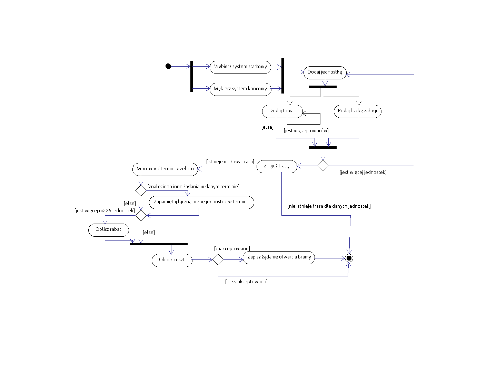

Analiza dynamiczna
==================
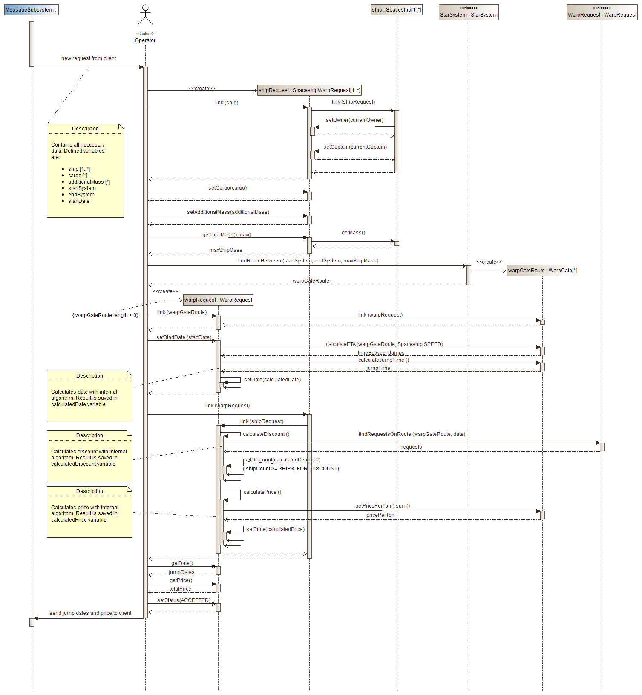

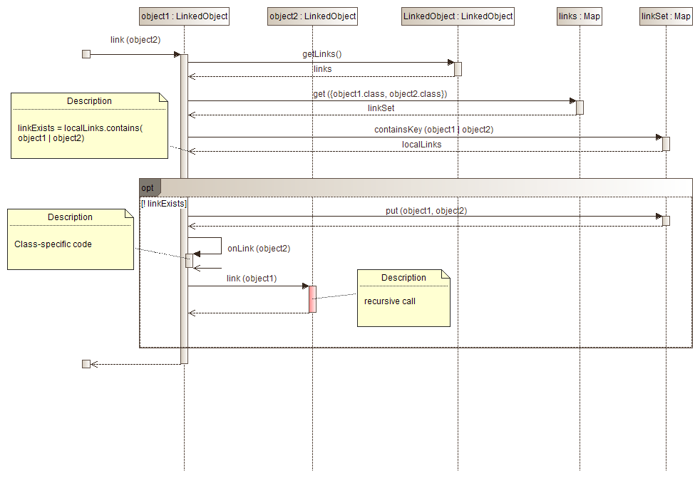

Rysunek 8 Diagram interakcji dla metody LinkedObject.link(LinkedObject)

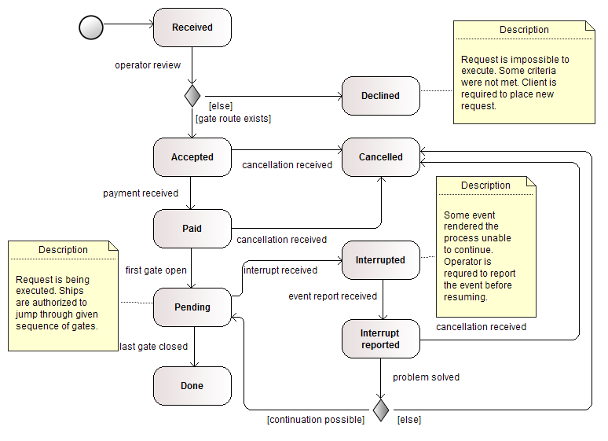

Rysunek 9 Diagram stanu dla obiektu klasy WarpRequest (Żądanie otwarcia)

Założenia analizy dynamicznej
-----------------------------

Projekt będzie implementowany w języku Groovy

Analiza dynamiczna została przeprowadzona na 2 poziomach abstrakcji. Diagram interakcji (Rysunek 7) dla przypadku użycia nie zawiera pełnej implementacji asocjacji. Zakłada także, że powiązane obiekty są widoczne jako pola. Uwzględnienie dokładnej implementacji znacznie skomplikowałoby diagram. Bardziej szczegółowa implementacja asocjacji została przedstawiona na dodatkowym diagramie (Rysunek 8).

Diagramy klas pomijają operacje dostępu do pól (gettery/setery). Umieszczenie ich na diagramach byłoby niepotrzebnym skomplikowaniem i obniżałoby czytelność dokumentacji. Jest to także zgodne z konwencją języka Groovy, w którym projekt ma być implementowany. Operacje te istnieją w tworzonych klasach, ale są generowane i wykonywane niejawnie.

Nazwy klas oraz pól w implementacji są przedstawione w języku angielskim. Analityczny model klas zostaje przetłumaczony przed analizą dynamiczną.

Skutki analizy „implementacyjnej” (faza pierwsza)
-------------------------------------------------

Faza pierwsza obejmowała zamianę konstrukcji UML nieistniejących w docelowym języku programowania oraz przetłumaczenie diagramu. Asocjacje zostały pozostawione na diagramie klas dla lepszej czytelności. W czasie tej fazy zostały dokonane zmiany w diagramie mające na celu uproszczenie modelu.

-   Przetłumaczono nazwy w modelu na język angielski

-   Usunięto nieistniejących konstrukcji:

    -   Kompozycję zastąpiono zwykłymi asocjacjami. Decyzje implementacyjne dot. ograniczeń pozostawiono na kolejne fazy projektowe.

    -   Asocjację z kwantyfikatorem (Żądanie otwarcie – Jednostka) usunięto ze względu na błąd w modelu analitycznym. Dane przeniesiono do klasy pośredniej

    -   Jeden aspekt z dziedziczenia wieloaspektowego (hierarchia Punkt użyteczności publicznej) został zamieniony na pole typu. Specyficzne implementacje zostały przeniesione do klasy bazowej. W implementacji zostaną naniesione ograniczenia.

    -   Atrybuty pochodne zostały zastąpione metodami.

    -   Atrybuty wielokrotne zostaną zaimplementowane jako kolekcje.

    -   Atrybuty wyliczeniowe zostały zastąpione enumeracjami

-   Zdefiniowano typy atrybutów

-   Zdefiniowano dodatkowe typy danych. Zostaną one zaimplementowane jako klasy. Obiekty tych klas będą niemutowalne.

-   Wykryto błędy analizy statycznej:

    -   Powielone atrybuty oraz operacje – dodano klasę bazową SpaceObject dla wszystkich obiektów reprezentujących fizyczne byty w przestrzeni kosmicznej. Zdefiniowano uniwersalne typy danych reprezentujące pozycję oraz ruch. Usunięto całkowicie atrybut asocjacji Tunel hiperprzestrzenny ze względu na możliwość wyliczenia wszystkich jego atrybutów na podstawie powiązanych obiektów.

    -   Skopiowano atrybuty kapitan oraz właściciel klasy Jednostka do klasy Żądanie otwarcia dla utrwalenia stanu w momencie żądania.

Skutki analizy dynamicznej (faza druga)
---------------------------------------

Faza druga analizy statycznej obejmowała utworzenie diagramu interakcji przypadku użycia „Żądanie otwarcia bramy” oraz diagramu stanu obiektów klasy WarpRequest

-   Utworzenie klasy LinkedObject odpowiedzialnej za zarządzanie asocjacjami oraz ekstensją. Trwałość ekstensji nie została uwzględniona w dokumentacji ze względu na wysoką złożoność oraz wysokie prawdopodobieństwo zmian podczas implementacji.

-   Wykrycie błędów analizy statycznej:

    -   brakujące pola i stałe w klasach WarpRequest oraz Spaceship

    -   brakujące metody w klasach SpaceObject, StarSystem, WarpRequest oraz WarpGate

    -   brakujące stany obiektów klasy WarpRequest (dodano wartości enumeracji RequestStatus)

Projekt interfejsu graficznego
==============================

Ekran startowy
--------------

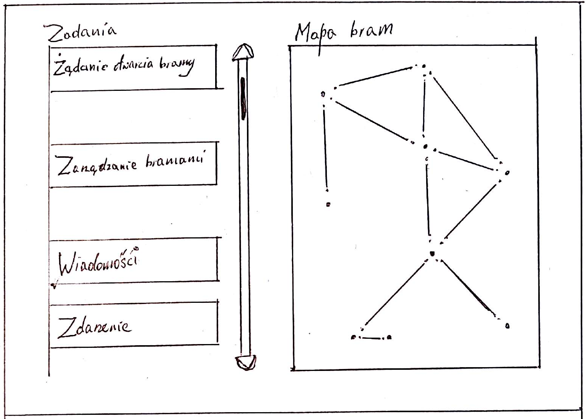

Żądanie otwarcia bramy – wybór trasy i daty
-------------------------------------------

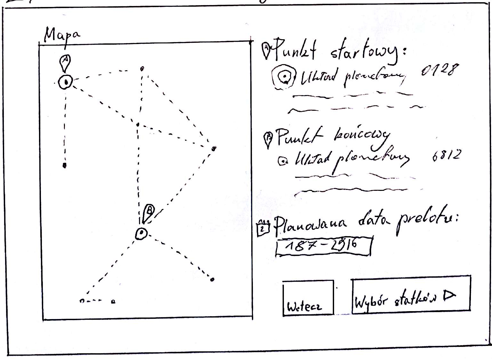

Żądanie otwarcia bramy – wybór statków
--------------------------------------

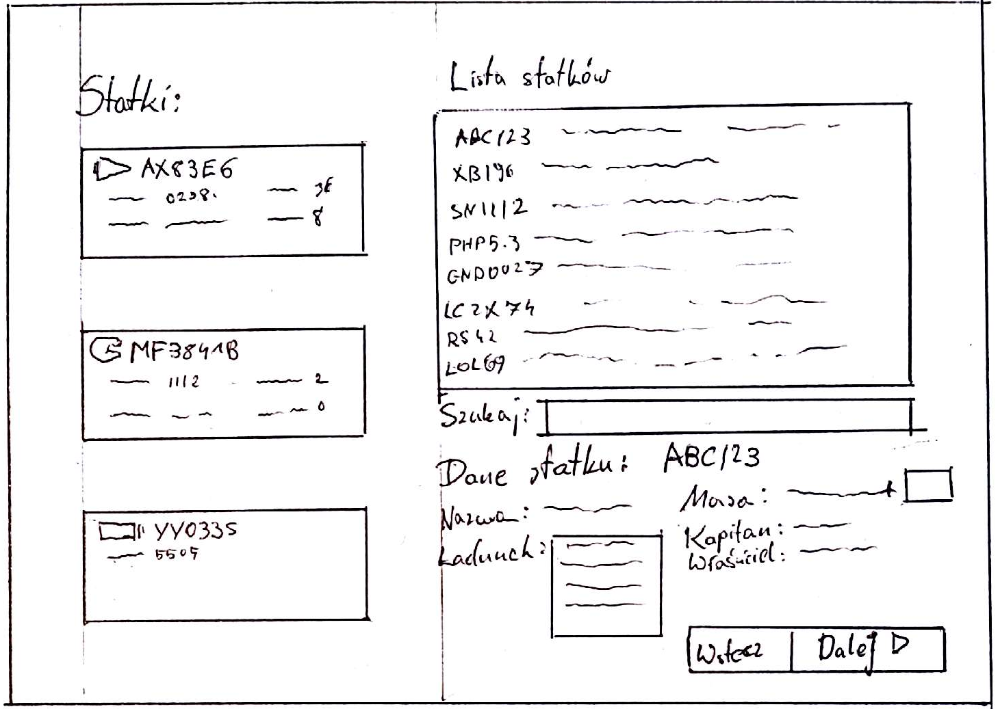

Żądanie otwarcia bramy – podsumowanie
-------------------------------------

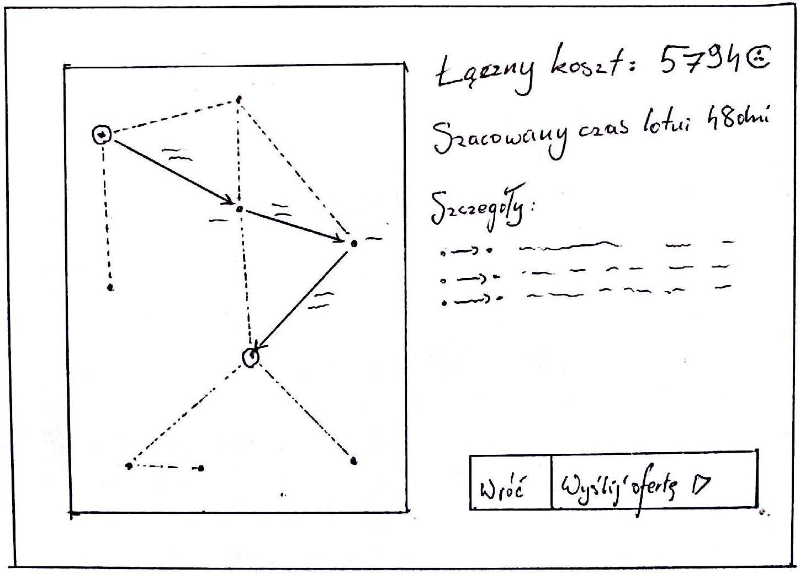

Słownik
=======

| Galaktyka                       | Obszar przestrzeni kosmicznej obejmowany przez system                                                                                                                                                                                                                                                                                                                          |
|---------------------------------|--------------------------------------------------------------------------------------------------------------------------------------------------------------------------------------------------------------------------------------------------------------------------------------------------------------------------------------------------------------------------------|
| System gwiezdny                 | 1.  Gwiazda lub zespół gwiazd wraz z krążącymi wokół niej ciałami niebieskimi, tj. planetami i pasami asteroidów.                                                                                                                                                                                                                                                              
                                                                                                                                                                                                                                                                                                                                                                                                                   
                                   2.  Obszar przestrzeni kosmicznej ograniczony najdalszą orbitą dookoła gwiazdy.                                                                                                                                                                                                                                                                                                 
                                                                                                                                                                                                                                                                                                                                                                                                                   
                                   3.  Węzeł sieci tuneli hiperprzestrzennych                                                                                                                                                                                                                                                                                                                                      |
| Planeta                         | Ciało niebieskie krążące wokół gwiazdy, wystarczająco duże, aby uzyskać prawie kulisty kształt. Może posiadać naturalne lub sztuczne satelity (w szczególności stacje kosmiczne). Jednostki latające mogą odbywać postoje na orbicie lub – jeżeli warunki ku temu sprzyjają – na powierzchni planety.                                                                          |
| Pas asteroid                    | Grupa asteroid krążących wokół gwiazdy na wspólnej orbicie. Przebywanie w pasie asteroid jest niebezpieczne, dlatego żadne budowle nie mogą się pojawić na ich obszarze.                                                                                                                                                                                                       |
| Punkt użyteczności publicznej   | Budowla pozwalająca zaspokoić określone potrzeby jednostki latającej oraz jej załogi. Może być to punkt serwisowy, restauracja, stacja ładowania, centrum handlowe itp.                                                                                                                                                                                                        |
| Jednostka latająca / jednostka  | Pojazd mogący przemieszczać się samodzielnie w przestrzeni kosmicznej pod dowództwem kapitana jednostki. Może przewozić towary oraz załogę. Posiada przyrządy pozwalające na komunikację z bramami międzygwiezdnymi. Posiada typ oraz masę definiujące możliwość korzystania z budowli w przestrzeni kosmicznej                                                                |
| Brama międzygwiezdna            | Budowla pozwalająca na otwarcie tunelu hiperprzestrzennego do bramy w innym systemie gwiezdnym. Także punkt komunikacji z systemem dla jednostek. Przelot przez bramę jest objęty opłatą wyliczaną na podstawie odległości oraz masy jednostki.                                                                                                                                |
| Tunel hiperprzestrzenny         | Zjawisko fizyczne pozwalające na pokonanie wielkich odległości w krótkim czasie. Wymaga otwarcia bramami międzygwiezdnymi na obu końcach. Utrzymanie połączenia wymaga dużych nakładów energii. Przelot przez tunel utrzymywany przez bramy znajdujące się w systemie jest objęty opłatą równą opłacie bramy początkowej.                                                      |
| Łańcuch bram międzygwiezdnych   | Ścieżka w sieci tuneli hiperprzestrzennych pozwalająca na pokonanie drogi pomiędzy dwoma systemami gwiezdnymi nawet jeżeli nie istnieje bezpośrednie połączenie między nimi. Przelot łańcuchem bram jest objęty opłatą równą sumie opłat wszystkich pokonanych tuneli.                                                                                                         |
| Promieniowanie kosmiczne        | Zjawisko emitowane przez gwiazdy. Natężenie spada proporcjonalnie do kwadratu odległości od źródła. W zależności od typu i natężenia jest szkodliwe dla organizmów żywych, w szczególności dla załóg jednostek, a także – w znacznie mniejszym stopniu – dla samych jednostek. Natężenie umownie wyraża się w liczbie jednostek natężenia.                                     |
| Punkt serwisowy                 | Budowla pozwalająca na naprawę jednostki po zdarzeniach.                                                                                                                                                                                                                                                                                                                       |
| Załoga jednostki                | Grupa organizmów żywych znajdujących się na pokładzie jednostki w trakcie lotu. Część lub całość załogi może brać czynny udział w locie. Z załogi wyróżniony jest kapitan, który jest odpowiedzialny za jednostkę (może być on jedynym członkiem załogi). Podróże jednostek autonomicznych nie są obecnie legalne, w związku z czym załoga jest nieodłączną częścią jednostki. |
| Pracownik bramy międzygwiezdnej | Osoba odpowiedzialna za monitorowanie stanu bramy, odbieranie żądań i ich akceptację oraz obsługę bramy, w tym między innymi otwieranie i zamykanie jej.                                                                                                                                                                                                                       |
| Pracownik centrali sieci        | Osoba odpowiedzialna za monitorowanie ogólnej kondycji sieci. Analizuje raporty sporządzane przez system. Może akceptować żądania przelotu przez łańcuchy bram.                                                                                                                                                                                                                |

